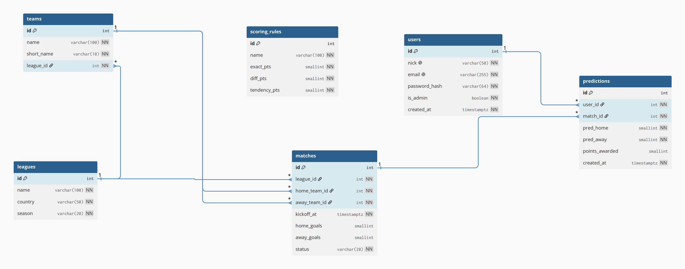
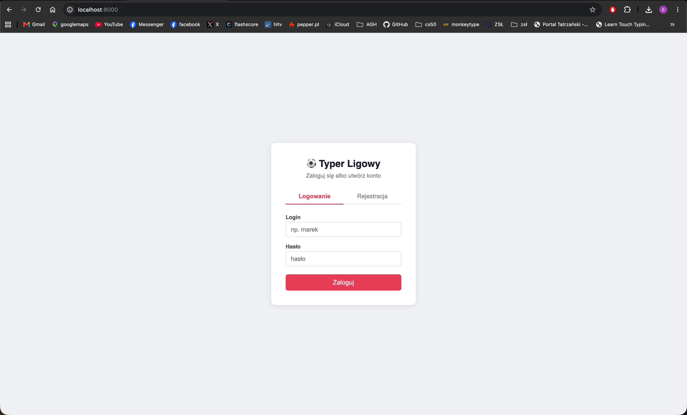
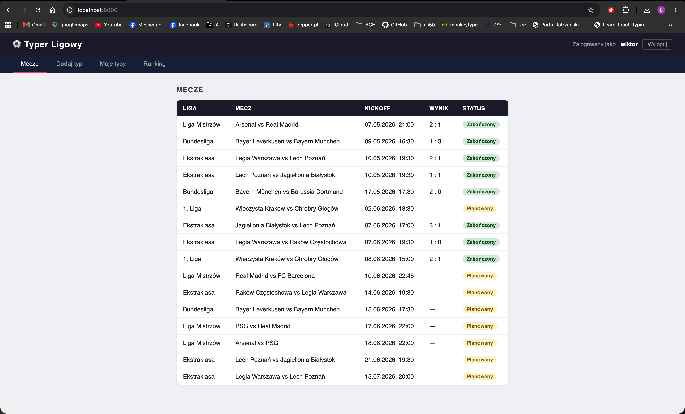
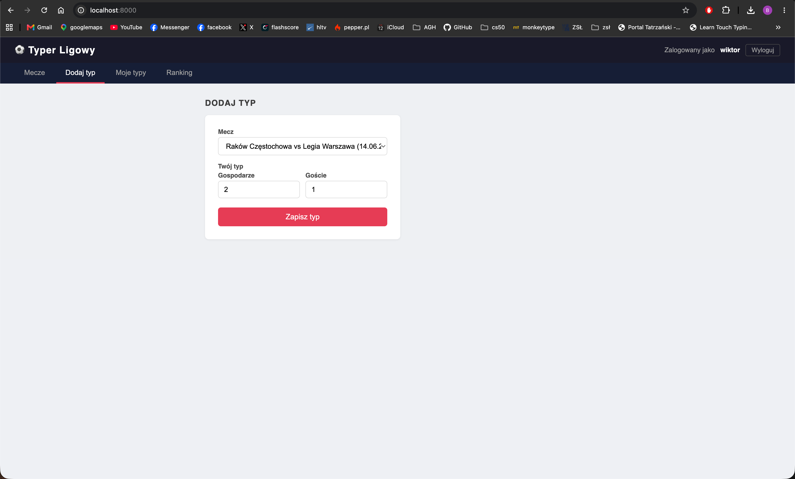
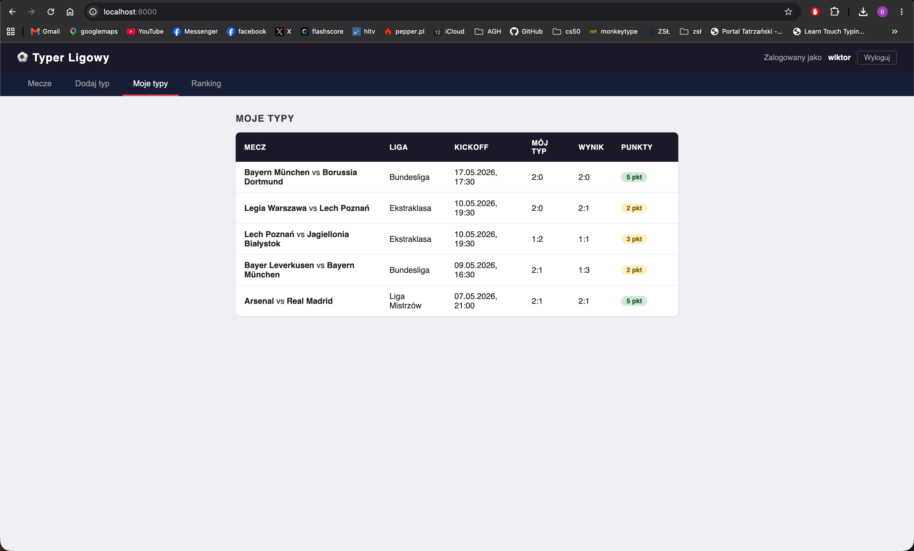
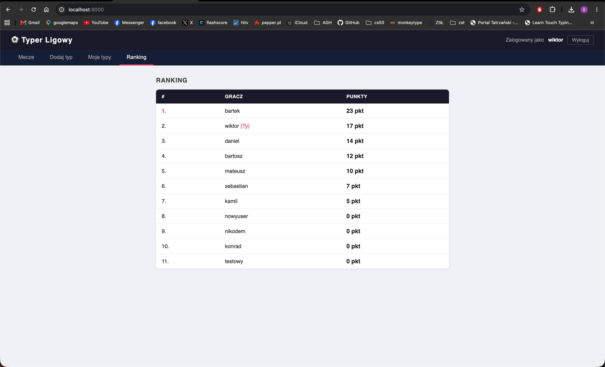
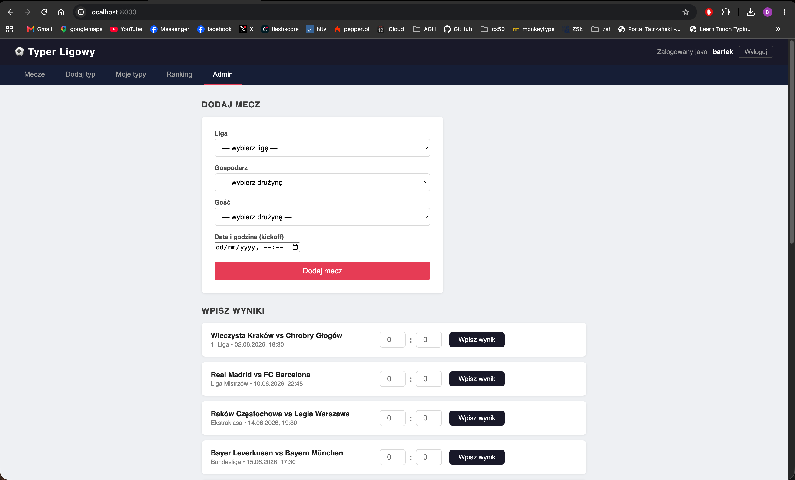
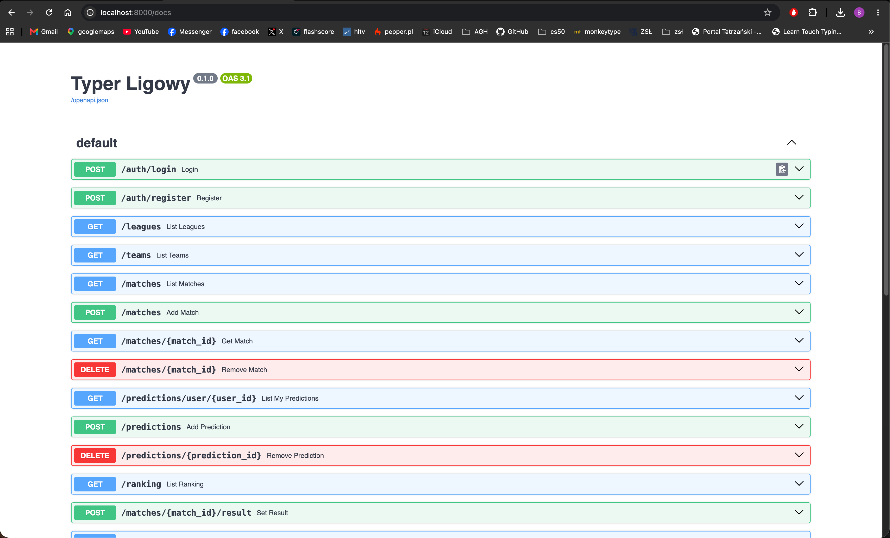
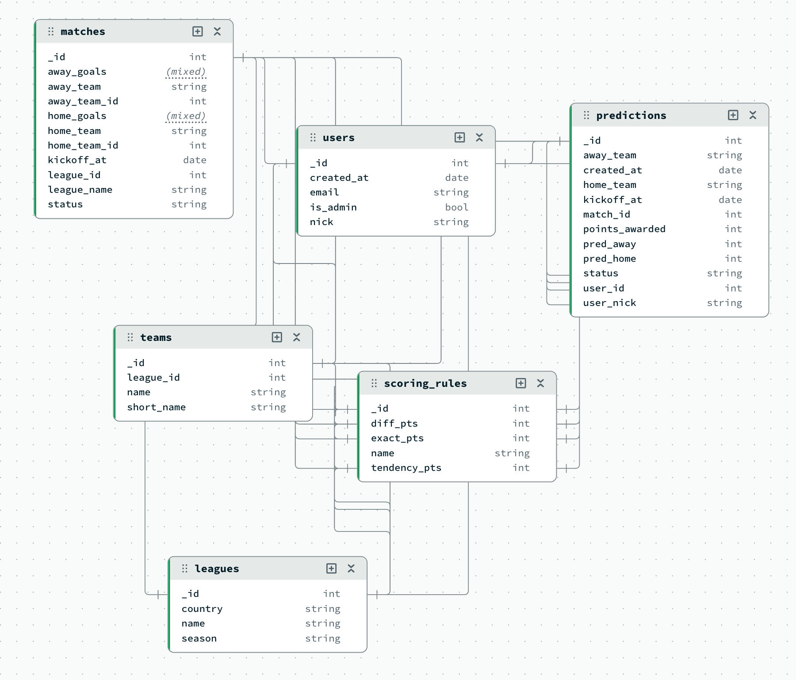

# Typer Ligowy

Aplikacja do typowania wyników meczów piłkarskich z systemem punktacji i rankingiem.
Projekt zaliczeniowy z przedmiotu Bazy Danych.

> 🇬🇧 [English version below](#typer-ligowy-english)

---

## Opis

Typer Ligowy pozwala użytkownikom typować wyniki meczów piłkarskich (Ekstraklasa, Bundesliga, Liga Mistrzów). Po zakończeniu meczu system automatycznie przelicza punkty dla wszystkich uczestników i aktualizuje ranking.

## Technologie

| Warstwa       | Technologia                              |
|---------------|------------------------------------------|
| Baza danych   | PostgreSQL 16                            |
| Baza NoSQL    | MongoDB 7                                |
| Backend       | Python 3.11+, FastAPI, uvicorn           |
| Dostęp do DB  | psycopg2 (jawne SQL, bez ORM)            |
| Walidacja     | Pydantic                                 |
| Frontend      | HTML + vanilla JS (SPA bez frameworka)   |
| Testy         | pytest                                   |
| Środowisko    | Docker, uv                               |

## Funkcjonalności

- Rejestracja i logowanie (SHA-256, sesja w localStorage)
- Przeglądanie listy meczów z ich statusem i wynikami
- Typowanie wyników — tylko przed rozpoczęciem meczu (walidacja po stronie serwera)
- Usuwanie własnego typu — tylko jeśli mecz jeszcze się nie zaczął
- Zakładka „Moje typy" — historia typów z kolorowym wskaźnikiem punktów
- Ranking graczy na żywo
- Panel admina — dodawanie nadchodzących meczów, wpisywanie wyników i usuwanie zakończonych meczów

## System punktacji

Liczy się najwyższy trafiony próg — punkty się nie sumują.

| Trafienie | Punkty |
|-----------|--------|
| Dokładny wynik (np. 2:1 → 2:1) | 5 |
| Trafiona różnica bramek (np. 2:1 → 3:2) | 3 |
| Tylko rezultat — kto wygrał (np. 2:1 → 4:0) | 2 |
| Pudło | 0 |

Trafiony remis zawsze daje 3 pkt (różnica 0 = 0), nigdy 2.
Wartości punktów są konfigurowalne przez tabelę `scoring_rules`.

## Jak uruchomić

**Wymagania:** Docker Desktop, Python 3.11+, [uv](https://github.com/astral-sh/uv)

```bash
# 1. sklonuj repo i wejdź do folderu
git clone <url>
cd typer

# 2. utwórz plik .env na podstawie przykładu
cp .env.example .env

# 3. uruchom bazę danych i zastosuj migracje (skrypt automatyczny)
bash db/reset_db.sh

# 4. zainstaluj zależności Python
uv sync

# 5. uruchom aplikację
uv run uvicorn main:app --reload
```

Aplikacja dostępna pod:
- **Frontend:** http://localhost:8000
- **Swagger UI (API):** http://localhost:8000/docs

### Synchronizacja z MongoDB (opcjonalnie)

```bash
uv run python db/mongo_seed.py
```

## Konta testowe

Hasło = login dla każdego konta. Konto `bartek` ma uprawnienia admina.

| Login     | Punkty |
|-----------|--------|
| bartek ⭐ | 21     |
| wiktor    | 17     |
| daniel    | 14     |
| bartosz   | 12     |
| mateusz   | 10     |
| sebastian | 7      |
| kamil     | 5      |
| konrad    | 0      |
| nikodem   | 0      |

## Endpointy API

| Metoda | Ścieżka                    | Opis                                              |
|--------|----------------------------|---------------------------------------------------|
| POST   | `/auth/login`              | Logowanie                                         |
| POST   | `/auth/register`           | Rejestracja                                       |
| GET    | `/matches`                 | Lista wszystkich meczów                           |
| GET    | `/matches/{id}`            | Szczegóły meczu                                   |
| GET    | `/leagues`                 | Lista lig                                         |
| GET    | `/teams`                   | Lista drużyn                                      |
| POST   | `/predictions`             | Dodaj typ (tylko przed startem meczu)             |
| DELETE | `/predictions/{id}`        | Usuń swój typ (tylko przed startem meczu)         |
| GET    | `/predictions/user/{id}`   | Typy konkretnego użytkownika                      |
| GET    | `/ranking`                 | Ranking graczy                                    |
| POST   | `/matches`                 | Admin: dodaj nowy mecz                            |
| DELETE | `/matches/{id}`            | Admin: usuń zakończony mecz                       |
| POST   | `/matches/{id}/result`     | Admin: wpisz wynik + automatyczne przeliczenie    |

## Struktura bazy danych

6 tabel: `users`, `leagues`, `teams`, `matches`, `predictions`, `scoring_rules`

Ranking to zapytanie agregujące — nie osobna tabela:
```sql
SELECT u.nick, COALESCE(SUM(p.points_awarded), 0) AS total_points
FROM users u
LEFT JOIN predictions p ON p.user_id = u.id
LEFT JOIN matches m ON p.match_id = m.id AND m.status = 'finished'
GROUP BY u.id, u.nick
ORDER BY total_points DESC
```

## Układ katalogów

```
typer/
├── main.py                  # entry point FastAPI
├── domain/
│   ├── scoring.py           # czysta funkcja punktująca (bez I/O)
│   ├── match_results.py     # przeliczanie punktów po meczu
│   └── predictions.py       # walidacja deadline'u typowania
├── db/
│   ├── connection.py        # pula połączeń psycopg2
│   ├── queries.py           # wszystkie SQL-e jako stałe
│   ├── migrations/          # wersjonowane migracje schematu
│   │   ├── 001_init.sql
│   │   └── 002_seed.sql
│   ├── reset_db.sh          # skrypt czyszczący i inicjalizujący bazę
│   └── mongo_seed.py        # synchronizacja danych do MongoDB
├── routers/
│   ├── auth.py              # POST /auth/login, /auth/register
│   ├── matches.py           # GET /matches, /leagues, /teams
│   ├── predictions.py       # POST + DELETE /predictions
│   ├── ranking.py           # GET /ranking
│   └── admin.py             # admin: dodaj/usuń mecz, wpisz wynik
├── schemas/
│   └── models.py            # Pydantic modele request/response
├── frontend/
│   └── index.html           # SPA — 5 zakładek, vanilla JS
├── tests/
│   └── test_scoring.py      # unit testy funkcji punktującej
├── docker-compose.yml
├── pyproject.toml
└── .env.example
```

## Uruchomienie testów

```bash
uv run pytest
```

## Zrzuty ekranu

### Diagram ER


### Logowanie


### Lista meczów


### Dodaj typ


### Moje typy


### Ranking


### Panel admina


### Swagger UI


### MongoDB Compass — schemat kolekcji


---

# Typer Ligowy (English)

A football match prediction app with a scoring system and leaderboard.
University database course project.

> 🇵🇱 [Wersja polska powyżej](#typer-ligowy)

---

## Description

Typer Ligowy lets users predict football match results (Ekstraklasa, Bundesliga, Champions League). After a match finishes, the system automatically calculates points for all participants and updates the leaderboard.

## Tech Stack

| Layer        | Technology                              |
|--------------|-----------------------------------------|
| Database     | PostgreSQL 16                           |
| NoSQL        | MongoDB 7                               |
| Backend      | Python 3.11+, FastAPI, uvicorn          |
| DB access    | psycopg2 (raw SQL, no ORM)              |
| Validation   | Pydantic                                |
| Frontend     | HTML + vanilla JS (SPA, no framework)   |
| Tests        | pytest                                  |
| Environment  | Docker, uv                              |

## Features

- User registration and login (SHA-256, session in localStorage)
- Match list with status and results
- Match predictions — only allowed before kickoff (server-side validation)
- Delete own prediction — only before kickoff
- "My predictions" tab — prediction history with colored point badges
- Live player leaderboard
- Admin panel — add upcoming matches, enter results, delete finished matches

## Scoring System

Only the highest matching tier is awarded — points do not stack.

| Match type | Points |
|------------|--------|
| Exact score (e.g. 2:1 → 2:1) | 5 |
| Correct goal difference (e.g. 2:1 → 3:2) | 3 |
| Correct result — who won (e.g. 2:1 → 4:0) | 2 |
| Miss | 0 |

A correctly predicted draw always gives 3 pts (difference 0 = 0), never 2.
Point values are configurable via the `scoring_rules` table.

## How to Run

**Requirements:** Docker Desktop, Python 3.11+, [uv](https://github.com/astral-sh/uv)

```bash
# 1. clone the repo
git clone <url>
cd typer

# 2. create .env from the example
cp .env.example .env

# 3. start the database and apply migrations (automated script)
bash db/reset_db.sh

# 4. install Python dependencies
uv sync

# 5. start the app
uv run uvicorn main:app --reload
```

App available at:
- **Frontend:** http://localhost:8000
- **Swagger UI (API):** http://localhost:8000/docs

### MongoDB sync (optional)

```bash
uv run python db/mongo_seed.py
```

## Test Accounts

Password = username for every account. `bartek` has admin privileges.

| Username   | Points |
|------------|--------|
| bartek ⭐  | 21     |
| wiktor     | 17     |
| daniel     | 14     |
| bartosz    | 12     |
| mateusz    | 10     |
| sebastian  | 7      |
| kamil      | 5      |
| konrad     | 0      |
| nikodem    | 0      |

## API Endpoints

| Method | Path                       | Description                                    |
|--------|----------------------------|------------------------------------------------|
| POST   | `/auth/login`              | Log in                                         |
| POST   | `/auth/register`           | Create account                                 |
| GET    | `/matches`                 | List all matches                               |
| GET    | `/matches/{id}`            | Match details                                  |
| GET    | `/leagues`                 | List leagues                                   |
| GET    | `/teams`                   | List teams                                     |
| POST   | `/predictions`             | Add prediction (only before kickoff)           |
| DELETE | `/predictions/{id}`        | Delete own prediction (only before kickoff)    |
| GET    | `/predictions/user/{id}`   | Predictions for a specific user                |
| GET    | `/ranking`                 | Player leaderboard                             |
| POST   | `/matches`                 | Admin: add new match                           |
| DELETE | `/matches/{id}`            | Admin: delete finished match                   |
| POST   | `/matches/{id}/result`     | Admin: set result + auto-calculate points      |

## Database Schema

6 tables: `users`, `leagues`, `teams`, `matches`, `predictions`, `scoring_rules`

The leaderboard is an aggregate query — not a separate table:
```sql
SELECT u.nick, COALESCE(SUM(p.points_awarded), 0) AS total_points
FROM users u
LEFT JOIN predictions p ON p.user_id = u.id
LEFT JOIN matches m ON p.match_id = m.id AND m.status = 'finished'
GROUP BY u.id, u.nick
ORDER BY total_points DESC
```

## Directory Structure

```
typer/
├── main.py                  # FastAPI entry point
├── domain/
│   ├── scoring.py           # pure scoring function (no I/O)
│   ├── match_results.py     # point calculation after match
│   └── predictions.py       # prediction deadline validation
├── db/
│   ├── connection.py        # psycopg2 connection pool
│   ├── queries.py           # all SQL as string constants
│   ├── migrations/          # versioned schema migrations
│   │   ├── 001_init.sql
│   │   └── 002_seed.sql
│   ├── reset_db.sh          # wipe and reinitialize the database
│   └── mongo_seed.py        # sync PostgreSQL data to MongoDB
├── routers/
│   ├── auth.py              # POST /auth/login, /auth/register
│   ├── matches.py           # GET /matches, /leagues, /teams
│   ├── predictions.py       # POST + DELETE /predictions
│   ├── ranking.py           # GET /ranking
│   └── admin.py             # admin: add/delete match, set result
├── schemas/
│   └── models.py            # Pydantic request/response models
├── frontend/
│   └── index.html           # SPA — 5 tabs, vanilla JS
├── tests/
│   └── test_scoring.py      # unit tests for scoring function
├── docker-compose.yml
├── pyproject.toml
└── .env.example
```

## Running Tests

```bash
uv run pytest
```

## Screenshots

### ER Diagram


### Login


### Match list


### Add prediction


### My predictions


### Leaderboard


### Admin panel


### Swagger UI


### MongoDB Compass — collection schema

